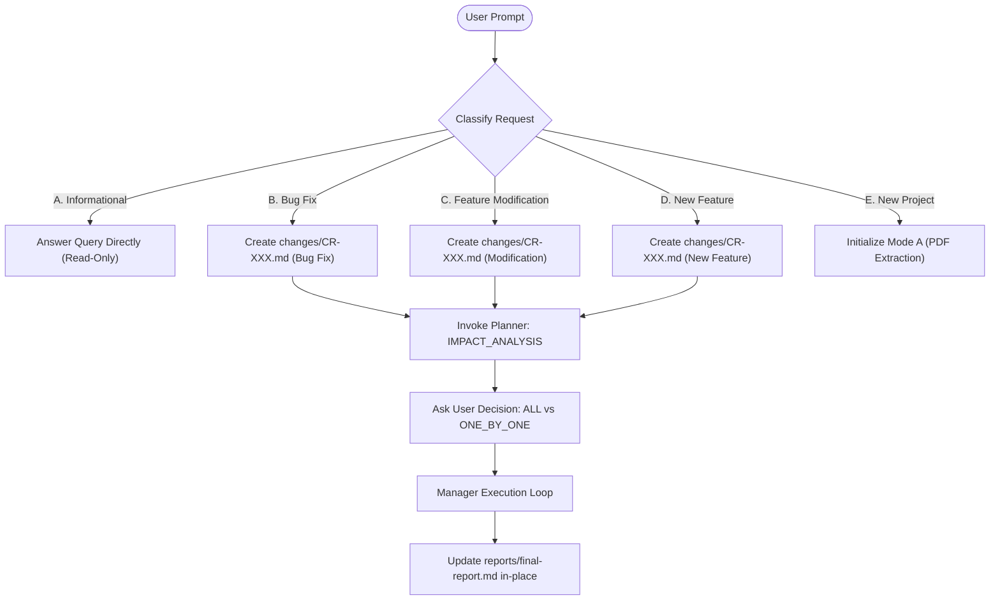

# Default Agent Change Detection & Session Routing Protocol

When the user interacts with the default Antigravity agent in a repository, the agent must inspect the repository state and classify the user's intent into one of five distinct categories before taking action:

---

## Intent Classification Matrix

| Category | Typical User Query Examples | System Action | Development Workflow Triggered? |
| :--- | :--- | :--- | :---: |
| **A. Informational** | *"What does the auth module do?"*, *"Where is database initialized?"*, *"Explain how password hashing works."* | Use read tools (`view_file`, `grep_search`). Answer user directly in chat. | **NO** (Zero state/task changes) |
| **B. Bug Fix** | *"Login crashes when password is incorrect"*, *"Fix 500 error on registration"*, *"Button is unresponsive on mobile"*. | 1. Identify next `CR-XXX` ID (e.g. `CR-001`). 2. Write `changes/CR-XXX.md` with `Risk: MEDIUM/HIGH`. 3. Invoke `planner` for Impact Analysis. 4. Reopen affected verified tasks or create fix task. 5. Request user execution mode (`ALL` vs `ONE_BY_ONE`). | **YES** (`CHANGE_SESSION`) |
| **C. Existing Feature Modification** | *"Change the authentication card layout"*, *"Increase session expiration to 7 days"*, *"Update button colors"*. | 1. Create `changes/CR-XXX.md`. 2. Invoke `planner` for Impact Analysis. 3. Mark invalidated tasks as `REOPENED` or `SUPERSEDED`. 4. Request user execution mode. 5. Execute via Manager. | **YES** (`CHANGE_SESSION`) |
| **D. New Feature** | *"Add recurring expenses"*, *"Add OAuth login with Google"*, *"Implement export to CSV"*. | 1. Create `changes/CR-XXX.md`. 2. Snapshot `project-context.md` to `docs/project-context-history/`. 3. Planner creates new sequential tasks (`TASK-005`, etc.). 4. Request user execution mode. 5. Execute via Manager. 6. Update `reports/final-report.md`. | **YES** (`CHANGE_SESSION`) |
| **E. New Project** | *"Here is the project overview PDF for an expense tracker"*, *"Initialize new project from spec"*. | 1. Verify fresh or uninitialized repository. 2. Trigger Mode A: Context Extractor $\rightarrow$ `project-context.md` $\rightarrow$ Planner $\rightarrow$ Initial Task Graph $\rightarrow$ User Choice $\rightarrow$ Manager. | **YES** (`INITIAL_BUILD`) |

---

## Critical Rules
1. **Never Rebuild Completed Projects**: An existing project with `reports/final-report.md` must NEVER be re-initialized from scratch. Existing verified tasks remain verified unless explicitly reopened by the Planner.
2. **Never Fabricate CR IDs**: Check `changes/` to find the highest existing index (`CR-001`, `CR-002`, etc.) and increment sequentially.
3. **Mandatory User Decision Gate**: The default agent must STOP and ask the user whether to execute `ALL` or `ONE_BY_ONE` before invoking the Manager to implement changes.
4. **Canonical Report Preservation**: On session completion, the existing `reports/final-report.md` is updated in-place with the change history entry. Never create duplicate reports (such as `final-report-v2.md`).
