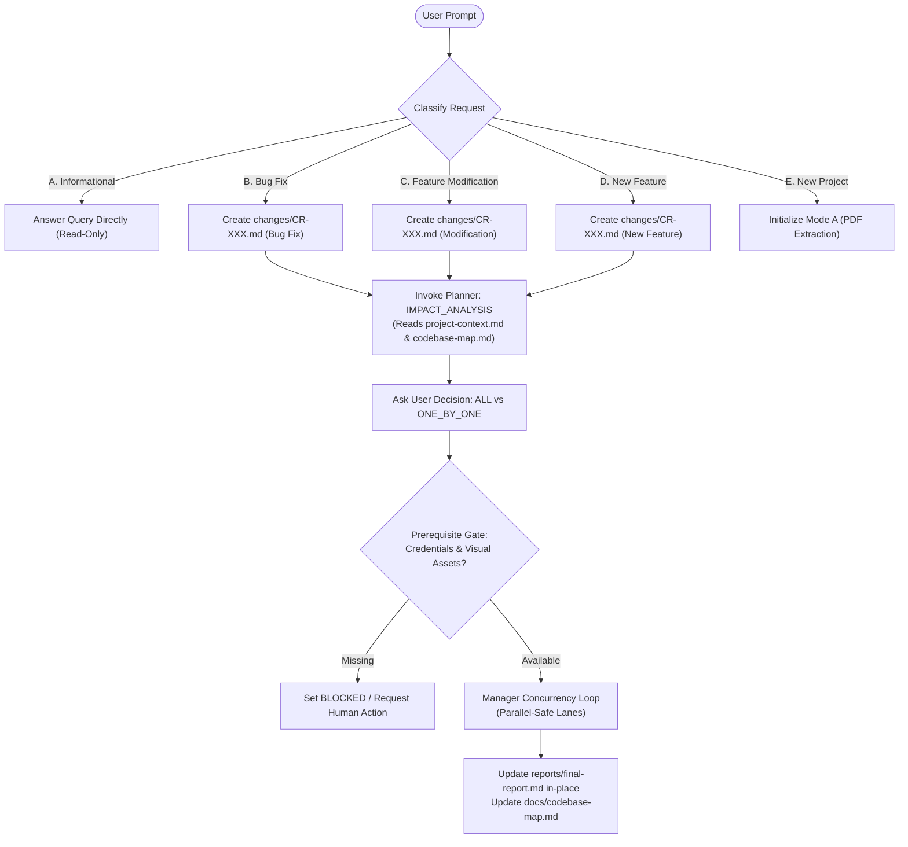

# Default Agent Change Detection & Session Routing Protocol

When the user interacts with the default Antigravity agent in a repository, the agent must inspect the repository state and classify the user's intent into one of five distinct categories before taking action:

---

## Intent Classification Matrix

| Category | Typical User Query Examples | System Action | Development Workflow Triggered? |
| :--- | :--- | :--- | :---: |
| **A. Informational** | *"What does the auth module do?"*, *"Where is database initialized?"*, *"Explain how balance calculation works."* | Use read tools (`view_file`, codebase map). Answer user directly in chat. | **NO** (Zero state/task changes) |
| **B. Bug Fix** | *"Login crashes when password is incorrect"*, *"Fix 500 error on upload"*, *"Button is unresponsive on mobile"*. | 1. Identify next `CR-XXX` ID (e.g. `CR-001`). 2. Write `changes/CR-XXX.md` with `Risk: MEDIUM/HIGH`. 3. Planner inspects `codebase-map.md` & impact. 4. Reopen affected verified tasks or create fix task. 5. Request user execution mode (`ALL` vs `ONE_BY_ONE`). | **YES** (`CHANGE_SESSION`) |
| **C. Existing Feature / Design Modification** | *"Change the expense card layout"*, *"Update button colors to match design"*, *"New Stitch design exported for home screen"*. | 1. Create `changes/CR-XXX.md`. 2. If design changed: save new reference as `docs/design/<screen>/v{N}.png` and update `docs/design/design-manifest.md`. 3. Planner identifies affected visual tasks; marks them `REOPENED` or creates targeted tasks, preserving unaffected verified tasks. 4. Request user execution mode. 5. Execute via Manager (Coder $\rightarrow$ Strict Tester $\rightarrow$ Browser QA with visual comparison against new reference). | **YES** (`CHANGE_SESSION`) |
| **D. New Feature / New Screen** | *"Add recurring expenses"*, *"Add image upload using Cloudinary"*, *"Make a new analytics screen using the same Stitch style"*. | 1. Create `changes/CR-XXX.md`. 2. **Stitch Design Extension Check** (if new screen requested):    - Check if project has an existing Stitch design (`docs/design/design-manifest.md`).    - If screen exists in Stitch $\rightarrow$ use existing Stitch screen as source of truth.    - If screen does NOT exist in Stitch but user wants same Stitch style $\rightarrow$ inspect existing Stitch screens as visual/style reference.    - If Stitch MCP is available and supports generation $\rightarrow$ call `stitch:generate_screen_from_text` and download to `docs/design/`.    - If Stitch MCP cannot generate or is unavailable $\rightarrow$ do NOT pretend; use existing Stitch screens as style reference (`preserve_existing_design_language: true`). 3. Snapshot `project-context.md` to `docs/project-context-history/`. 4. Planner creates parallel-safe sequential tasks with design extension metadata. 5. Request user execution mode. 6. Execute via Manager; update `codebase-map.md` & `final-report.md`. | **YES** (`CHANGE_SESSION`) |
| **E. New Project** | *"Here is the project overview PDF for an expense tracker"*, *"Initialize new project from spec"*. | 1. Verify fresh or uninitialized repository. 2. Trigger Mode A: Context Extractor $\rightarrow$ `project-context.md` $\rightarrow$ `codebase-map.md` scaffold $\rightarrow$ Planner $\rightarrow$ Initial Task Graph $\rightarrow$ User Choice $\rightarrow$ Manager. | **YES** (`INITIAL_BUILD`) |

---

## Critical Rules
1. **Never Rebuild Completed Projects**: An existing project with `reports/final-report.md` must NEVER be re-initialized from scratch. Existing verified tasks remain verified unless explicitly reopened by the Planner.
2. **Never Fabricate Credentials or Designs**: If a feature requires external API keys (e.g. Cloudinary, Stripe) or Stitch design references that are missing, mark the task `BLOCKED` with `HUMAN_ACTION_REQUIRED`. Never silently invent credentials, guess designs, or proceed without authoritative references.
3. **Stitch Design Extension Rule**: Never create a completely unrelated visual style when an existing Stitch design is available. When creating a new screen without a dedicated Stitch artifact, Coder and Browser QA must inspect and adhere to existing Stitch screens (`preserve_existing_design_language: true`). Never silently replace Stitch with an unreferenced AI-generated design.
4. **Traceable Design Versioning**: When Stitch designs change, preserve previous references (e.g. `docs/design/home/v1.png`) and document the transition in `changes/CR-XXX.md` and `docs/design/design-manifest.md`.
5. **Mandatory User Decision Gate**: The default agent must STOP and ask the user whether to execute `ALL` or `ONE_BY_ONE` before invoking the Manager to implement changes.
6. **Canonical Report & Map Updates**: On session completion, the existing `reports/final-report.md` is updated in-place and affected entries in `docs/codebase-map.md` are updated. Never create duplicate reports (such as `final-report-v2.md`).
