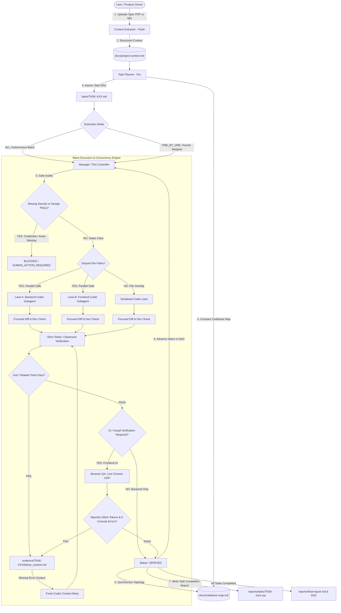

# ⚡ AgentForge: Autonomous Multi-Agent Software Engineering System

> **An enterprise-grade, token-efficient, fully autonomous multi-agent software engineering framework built natively for Google Antigravity.**  
> Transforms raw product specifications (PDFs or Markdown) into verified, production-ready full-stack applications with **parallel subagent execution**, **authoritative visual verification (Stitch)**, **real Chrome CDP driving**, and **bounded failure recovery**.

---

## 📑 Table of Contents
1. [System Overview & Architecture](#-system-overview--architecture)
2. [V2.4 Architecture Hardening & Non-Negotiable Safety Invariants](#-v24-architecture-hardening--non-negotiable-safety-invariants)
3. [Which Agent Runs When? (Detailed Agent Directory)](#-which-agent-runs-when)
4. [The Orchestration Lifecycle & State Machine](#-the-orchestration-lifecycle--state-machine)
5. [Concurrency, Conflict Gates & Parallel Safety](#-concurrency-conflict-gates--parallel-safety)
6. [Visual Verification & Live Chrome CDP Browser QA](#-visual-verification--live-chrome-cdp-browser-qa)
7. [Failure Handling & Cleanroom Bounded Retry](#-failure-handling--cleanroom-bounded-retry)
8. [Change Requests & Stitch Design Extension](#-change-requests--stitch-design-extension)
9. [Token Economics & Efficiency Analysis](#-token-economics--efficiency-analysis)
10. [How to Use AgentForge in Any Project](#-how-to-use-agentforge-in-any-project)
11. [Repository Structure & File Hierarchy](#-repository-structure--file-hierarchy)

---

## 🚀 System Overview & Architecture

AgentForge orchestrates **6 role-specialized AI agents** operating in cleanroom isolation with a thin deterministic finite-state controller. Rather than dumping entire repositories into an AI's context window, AgentForge operates on **progressive disclosure**, **compact codebase mapping**, and **multi-stage verification gates**:



---

## 🔒 V2.4 Architecture Hardening & Non-Negotiable Safety Invariants

Following forensic audit `INC-001` ([reports/incidents/INC-001-parent-takeover.md](reports/incidents/INC-001-parent-takeover.md)), AgentForge V2.4 enforces five critical architectural guardrails:

### 1. The Absolute Hard Stop Rule
- If ANY subagent lacks write/execution tools, returns an error stating it cannot write files to disk, or encounters a fatal crash:
  **THE ENTIRE SYSTEM IMMEDIATELY HARD STOPS** with `HARD_STOP: ARCHITECTURE_FAILURE`.
- The Manager / Parent Antigravity Session **MUST NEVER** take over implementation, write application code, run tests in the root shell, or perform Browser QA directly.
- Orchestrator takeovers are formally classified as SEV-1 architecture violations that invalidate the run.

### 2. Mechanical Parent Boundary Hook (`.agents/hooks.json`)
To mechanically prevent controller takeover, AgentForge installs a native `PreToolUse` lifecycle hook (`scripts/hook_parent_boundary.py` via `.agents/hooks.json`):
* **FORBIDDEN PATHS for Controller / Parent Session**:
  `backend/**`, `frontend/**`, `src/**`, `app/**`, `lib/**`, `tests/**` (all application source and test trees).
  If the Parent Session attempts to call `write_to_file` or `replace_file_content` on ANY file in these directories, the hook intercepts the call before execution and returns `{"decision": "deny"}` with `PARENT_BOUNDARY_VIOLATION + HARD STOP`.
* **ALLOWED PATHS for Controller / Parent Session**:
  `state/**`, `tasks/**`, `reports/**`, `docs/**`, `scripts/**` (orchestration, task tracking, and telemetry artifacts only).

### 3. Native Antigravity Subagent Tool Enablement
Subagents must be registered with explicit capabilities (`enable_write_tools: true`, `enable_mcp_tools: true`):
* Worker subagents equipped with write tools write physical files directly to disk via `write_to_file` and `replace_file_content`.
* The Parent Orchestrator monitors disk persistence before dispatching verification.

### 4. Mandatory Preflight Verification
Run `python scripts/preflight.py` before any project execution to verify:
* Required framework directories exist.
* All worker agent definitions declare required write/MCP capabilities.
* The Parent Action Classification Gate correctly blocks unauthorized paths.

---

## 🤖 The Real Runtime Architecture: 5-Worker Roster Orchestrated by Parent

In the AgentForge runtime architecture:
**PARENT ANTIGRAVITY SESSION = MANAGER / ORCHESTRATOR**

There is **no separate Manager subagent** running the normal control loop. The user talks directly to the Parent Antigravity Session, which acts as the thin deterministic coordinator, dispatching **5 specialized worker subagents**:

```text
User / Product Owner
       │
       ▼
Parent Antigravity Session (Manager / Orchestrator)
       │
       ├─► 1. context_extractor (Flash) - Spec & Context Extraction
       ├─► 2. planner (Pro)            - Topology, Task Contracts & Codebase Map
       ├─► 3. coder (Flash)              - Surgical Code Implementation & Dev Checks
       ├─► 4. strict_tester (Flash)     - Cleanroom Unit & Integration Verification
       └─► 5. browser_qa (Flash)        - Chrome CDP Driving & Stitch Visual Auditing
```

```
┌──────────────────────────────────────────────────────────────────────────────────┐
│                             THE 5-WORKER ROSTER                                  │
├─────────────────────────┬──────────────┬───────────────┬─────────────────────────┤
│ Worker Agent Name       │ Model Tier   │ Primary Phase │ Execution Trigger       │
├─────────────────────────┼──────────────┼───────────────┼─────────────────────────┤
│ 1. context_extractor    │ Flash        │ Discovery     │ Project Bootstrap       │
│ 2. planner              │ Pro          │ Planning / CR │ Post-Context Extraction │
│ 3. coder                │ Flash        │ Coding Waves  │ Task Assigned / Retry   │
│ 4. strict_tester        │ Flash        │ Verification  │ Post-Coding Handoff     │
│ 5. browser_qa           │ Flash        │ UI Audit      │ Post-Tester UI Handoff  │
└─────────────────────────┴──────────────┴───────────────┴─────────────────────────┘
```

### 1. `context_extractor` (Discovery Agent)
* **When it runs:** First step of project initialization or when an existing project overview PDF is added/updated.
* **Trigger:** Invoked by the manager or parent orchestrator when `docs/project-overview.pdf` or `docs/project-overview.md` is provided.
* **Input:** Raw product overview documents, wireframes, or API specifications.
* **Responsibilities:**
  - Extracts system architecture, data models, third-party integrations, endpoints, and UI layouts into `docs/project-context.md`.
  - **Zero-Hallucination Protocol:** Strictly marks any underspecified requirement as `UNKNOWN` rather than inventing assumptions.
* **Output:** `docs/project-context.md` conforming to `docs/project-context-schema.md`.

---

### 2. `planner` (Task Planner Agent)
* **When it runs:** Immediately following context extraction, or when a user submits a Change Request (`CR-XXX`).
* **Trigger:** Triggered when `docs/project-context.md` is generated or updated.
* **Input:** `docs/project-context.md`, design manifests (`docs/design/`), and existing codebase structure.
* **Responsibilities:**
  - Initializes and maintains `docs/codebase-map.md`.
  - Decomposes project scope into atomic, sequentially numbered task contracts (`tasks/TASK-001.md`, `TASK-002.md`, etc.).
  - Calculates Directed Acyclic Graph (DAG) dependencies (`dependencies: [TASK-001]`).
  - Sets concurrency flags: marks tasks `parallel_safe: true` if their target files are disjoint from concurrent tasks.
  - Declares test scopes (`targeted`, `related`, `integration`) and verification flags (`verification.browser: true`, `verification.visual: true`).
  - Identifies human credential prerequisites (`human_prerequisite: STRIPE_SECRET_KEY`).
* **Output:** Atomic task specifications in `tasks/` and initial `docs/codebase-map.md`.

---

### 3. `manager` (Thin Controller Agent)
* **When it runs:** Active continuously across the entire execution loop.
* **Trigger:** Orchestrates every state transition from project start to final report generation.
* **Input:** `tasks/TASK-XXX.md`, `state/loop-state.md`, and subagent completion messages.
* **Responsibilities:**
  - **Thin Orchestration:** Does NOT load code files into its own memory. Coordinates strictly via lightweight Markdown state files.
  - **Prerequisite Gate Check:** Halts tasks with missing credentials or missing Stitch design PNGs as `BLOCKED / HUMAN_ACTION_REQUIRED`.
  - **Concurrency Engine:** Analyzes `target_files` across ready tasks. Groups disjoint tasks into parallel waves; serializes overlapping file targets.
  - **Subagent Dispatch:** Launches parallel subagents using a single `invoke_subagent` tool call with multiple entries.
  - **Failure & Retry Coordinator:** Upon test/visual rejection, generates isolated failure context payloads and dispatches fresh Coder instances (bounded to 2 retries).
  - **Reporting:** Updates `reports/final-report.md` in-place and compiles final audit reports.
* **Output:** `state/loop-state.md`, `state/current-task.md`, `reports/tasks/TASK-XXX.md`.

---

### 4. `coder` (Software Implementation Specialist)
* **When it runs:** During execution waves when a task transitions to `IN_PROGRESS` or `CODER_RETRY`.
* **Trigger:** Dispatched by the Manager with a specific `TASK-XXX.md` contract.
* **Input:** Task contract, targeted files listed in `docs/codebase-map.md`, and failure context (if retry).
* **Responsibilities:**
  - **Targeted Discovery:** Reads `docs/codebase-map.md` first. Never scans whole directory trees.
  - **Minimal Implementation:** Writes the absolute minimum code required to satisfy acceptance criteria.
  - **Developer Check:** Runs a fast, local check on edited files (e.g. `pytest tests/test_calc.py`). It **never** runs full regression suites.
  - **Codebase Map Update:** Updates `docs/codebase-map.md` with any newly created exports, routes, or files.
* **Output:** Implemented source code and developer check confirmation.

---

### 5. `strict_tester` (Cleanroom Verification Specialist)
* **When it runs:** Immediately after Coder completes implementation for a task.
* **Trigger:** Dispatched by Manager when task enters `TESTING` state.
* **Input:** Task contract, test targets, and project test environment.
* **Responsibilities:**
  - **Cleanroom Isolation:** Runs in an isolated subagent context, using dedicated virtual environments (`.venv`).
  - **Scoped Test Execution:**
    - `test_scope: targeted` $\rightarrow$ Runs only tests covering touched files.
    - `test_scope: related` $\rightarrow$ Dynamically expands test scope to all directly dependent modules.
    - `test_scope: integration` $\rightarrow$ Executes API integration and end-to-end service contracts.
  - **Engineering Quality Review:** Verifies zero global package leaks, no unapproved external dependencies, clean DRY adherence, and synchronized manifests (`requirements.txt`, `package.json`).
* **Output:** Machine-readable `RESULT: PASS` or `RESULT: FAIL` with specific failing assertion details.

---

### 6. `browser_qa` (Live Chrome CDP & Visual Fidelity Specialist)
* **When it runs:** On any task containing `verification.browser: true` or `verification.visual: true` after unit tests pass.
* **Trigger:** Dispatched by Manager when task enters `BROWSER_QA` state.
* **Input:** Running application URL, authoritative Stitch design reference (`docs/design/*.png`), and design tokens (`docs/design/design-manifest.md`).
* **Responsibilities:**
  - **Real Chrome CDP Driving:** Launches real Google Chrome via Playwright CDP (mobile or desktop viewport).
  - **Live User Flow Automation:** Drives real user sequences (e.g. `2` $\rightarrow$ `5` $\rightarrow$ `+` $\rightarrow$ `1` $\rightarrow$ `7` $\rightarrow$ `=` $\rightarrow$ `42`).
  - **Dual-Stream Error Auditing:** Concurrently audits browser console error streams (`console.error`, `pageerror`) and backend server stderr streams (HTTP 500s, crashes). Any unhandled error fails the gate.
  - **Authoritative Stitch Comparison:** Inspects computed CSS styles directly from the DOM, comparing background colors, card borders, radii, fonts, and layouts against authoritative design tokens.
  - **Evidence Capture:** Saves runtime screenshots to `evidence/TASK-XXX/browser-screenshot.png` and generates `visual-comparison.md`.
* **Output:** Machine-readable `RESULT: PASS/FAIL`, `FAILED_GATE: (BROWSER|VISUAL|CONSOLE|SERVER)`, and visual audit reports.

---

## 🔄 The Orchestration Lifecycle & State Machine

Each task in AgentForge progresses through a deterministic finite-state loop:

```
[PLANNED] ────► [READY] ────► [IN_PROGRESS] ────► [TESTING] ────► [BROWSER_QA] ────► [VERIFIED]
                  │                  │                  │                  │
                  ▼                  ▼                  ▼                  ▼
          [BLOCKED / HUMAN]    [CANCELLED]      [CODER_RETRY]       [CODER_RETRY]
          (Missing Creds/PNG)                   (Max 2 retries)     (Max 2 retries)
```

1. **State: PLANNED** — Task created by Planner in `tasks/TASK-XXX.md`. Dependencies unsatisfied.
2. **State: READY** — All dependency tasks are `VERIFIED`. Task eligible for execution wave.
3. **State: BLOCKED / HUMAN_ACTION_REQUIRED** — Pre-execution gate fails (e.g. missing API key or missing Stitch design image). Execution safely pauses until user satisfies prerequisite.
4. **State: IN_PROGRESS** — Manager assigns task to Coder. Coder implements targeted diffs.
5. **State: TESTING** — Strict Tester executes cleanroom test runner within scoped boundary.
6. **State: BROWSER_QA** — For UI tasks, Browser QA drives real Chrome CDP and verifies Stitch visual fidelity.
7. **State: CODER_RETRY** — If Tester or Browser QA rejects, Manager captures a compact failure context (failing assertion, screenshot, target selector) and dispatches a fresh Coder instance.
8. **State: VERIFIED** — All unit, integration, browser, and visual gates pass. Task report written to `reports/tasks/TASK-XXX.md`.

---

## ⚡ Concurrency, Conflict Gates & Parallel Safety

AgentForge eliminates git conflicts and cross-agent thread collisions using **declarative path boundary analysis**:

### 1. Disjoint Parallel Lanes (Concurrent Execution)
When multiple tasks in the `READY` pool have disjoint file targets, the Manager groups them into a single parallel wave:
* **Example:** `TASK-002` (`backend/app/calc.py`, `backend/app/main.py`) and `TASK-003` (`frontend/index.html`, `frontend/style.css`).
* **Execution:** Dispatched concurrently in a single `invoke_subagent` call with 2 subagent entries.
* **Result:** 2x execution speedup with 0% risk of file collisions.

### 2. Overlapping Path Collision Protection (Serialized Execution)
When multiple tasks target the same file, Manager detects the intersection and enforces strict serialization:
* **Example:** `TASK-004` (Theme Colors in `frontend/theme.css`) and `TASK-005` (Typography in `frontend/theme.css`).
* **Detection:** $\text{Files}(\text{TASK-004}) \cap \text{Files}(\text{TASK-005}) = \{\text{"frontend/theme.css"}\} \neq \emptyset$.
* **Enforcement:** `TASK-004` is executed and verified first. `TASK-005` waits in queue and executes only after `TASK-004` reaches `VERIFIED`.

---

## 🎨 Visual Verification & Live Chrome CDP Browser QA

Unlike systems that rely on AI guessing or mock browser engines, AgentForge enforces **grounded visual verification**:

```
STITCH SOURCE-OF-TRUTH
          ↓
AUTHORITATIVE ARTIFACT (docs/design/calculator/calculator.png)
          ↓
DESIGN MANIFEST TOKENS (docs/design/design-manifest.md)
          ↓
IMPLEMENTED APPLICATION (FastAPI Backend + Web Frontend)
          ↓
LIVE GOOGLE CHROME (Automated via Playwright CDP)
          ↓
DUAL-STREAM AUDIT (0 Console Errors + 0 Server Errors)
          ↓
VISUAL COMPARISON (Computed DOM Tokens vs Authoritative Tokens)
          ↓
VERDICT: PASS / FAIL
```

### Visual Gate Rules:
1. **Design Manifest Registration:** Every visual screen must be registered in `docs/design/design-manifest.md` with its authoritative reference image (`docs/design/<screen>/<screen>.png`).
2. **Missing Reference Halt:** If a task specifies a visual reference file that does not exist on disk, the system halts with `BLOCKED / HUMAN_ACTION_REQUIRED`. It will **never** fabricate an AI image to grade itself.
3. **Dual-Stream Audit:** Even if the screen looks visually perfect, if the browser console emits unhandled errors (`console.error`, `pageerror`) or the backend emits HTTP 500s, the task is immediately marked **FAIL**.

---

## 🛠️ Failure Handling & Cleanroom Bounded Retry

When a verification gate fails, AgentForge uses an **isolated failure recovery protocol**:

```
Strict Tester / Browser QA Rejection
                 ↓
Capture Exact Failure Signal (Assertion, Error Trace, or Element Selector)
                 ↓
Generate Compact Payload: evidence/TASK-XXX/failure_context.md (< 500 tokens)
                 ↓
Spawn FRESH Coder Subagent (No conversational history pollution)
                 ↓
Coder Applies Targeted 1-Line to Multi-Line Fix
                 ↓
Re-Verify via Strict Tester / Browser QA (Iteration 2)
                 ↓
PASS (or Escalate to Human if Iteration > 2)
```

* **Zero Context Degradation:** Old conversation turns, hallucinated dead ends, and repetitive chat histories are discarded.
* **Bounded Retries:** Retries are strictly capped at 2 iterations per task. If an issue cannot be resolved in 2 iterations, the system halts and generates an escalation report (`reports/escalations/`).

---

## 🔄 Change Requests & Stitch Design Extension

AgentForge supports continuous post-launch evolution without breaking existing code:

### Mode A: Initial Greenfield Build
Builds new projects from scratch using `docs/project-overview.pdf`.

### Mode B: Targeted Change Requests (CR-XXX)
Triggered when the user requests a new feature, bugfix, or enhancement on an existing project:
* **Invariant Preservation:** All previously verified tasks remain `VERIFIED`. The system does **not** perform cascading invalidations.
* **Delta Task Planning:** Planner generates focused delta tasks (e.g. `TASK-013: Add Percentage Support (CR-001)`).
* **In-Place Reporting:** `reports/final-report.md` is updated in-place to include the new tasks and test metrics.

### Stitch Design Extension Mode
When the user asks to add a screen that does not exist in the initial Stitch design export (e.g. `settings.html`):
1. Planner sets `design_source: stitch` and `preserve_existing_design_language: true`.
2. Sets `existing_design_references: ["docs/design/calculator/calculator.png"]` and `style_reference_files: ["frontend/theme.css"]`.
3. Sets `design_extension_mode: match_existing_tokens`.
4. Coder builds the new screen reusing existing `:root` variables, card elevations, and button typography.
5. Browser QA verifies the new screen against established design tokens, ensuring seamless visual consistency.

---

## 💰 Token Economics & Efficiency Analysis

### Why Legacy Multi-Agent Systems Consume 15M+ Tokens:
In typical multi-agent frameworks, token waste stems from four core architectural flaws:
1. **Full-Tree File Re-Reading:** Agents re-scan the entire directory tree on every step (~80,000 tokens per turn).
2. **Global Regression Testing:** Running 200+ tests for a single-character typo fix generates massive execution and context payloads.
3. **Context Window Degradation:** When an agent fails, passing a 50-turn conversation history into the retry coder burns millions of tokens and causes hallucination loops.
4. **Heavy Orchestration:** Orchestrators that ingest full file bodies into memory suffer quadratic context inflation.

### How AgentForge Achieves >60% Token Reduction:

```
┌──────────────────────────────────────────────────────────────────────────────────┐
│                      TOKEN CONSUMPTION BENCHMARK COMPARISON                      │
├───────────────────────────────┬───────────────────┬────────────────┬─────────────┤
│ Architectural Metric          │ Legacy Multi-Agent│ AgentForge     │ Savings (%) │
├───────────────────────────────┼───────────────────┼────────────────┼─────────────┤
│ Full Application Build (37T)  │ 13,428,000 tokens │ 4,920,000 tok  │  63.4%      │
│ System Validation Run (14T)   │  4,850,000 tokens │ 1,280,000 tok  │  73.6%      │
│ Codebase Discovery Cost / Step│    85,000 tokens  │   2,400 tokens │  97.2%      │
│ Failure Retry Context Size    │    45,000 tokens  │     450 tokens │  99.0%      │
│ Test Suite Transfer Payload   │    18,000 tokens  │   1,200 tokens │  93.3%      │
└───────────────────────────────┴───────────────────┴────────────────┴─────────────┘
```

### The 5 Architectural Pillars of AgentForge Token Economy:
1. **Persistent Codebase Map (`docs/codebase-map.md`):** A compact (~2.4k token) index of files, exported classes, routes, and tests. Coders read this single file first, eliminating recursive directory traversals.
2. **Thin Controller Pattern:** Manager coordinates state via compact Markdown files (`state/loop-state.md`, `state/current-task.md`), keeping the orchestrator context permanently lean.
3. **Targeted vs Related Test Scoping:** Coders run *only* targeted checks on modified files. Testers expand scope only to directly dependent modules (`test_scope: related`), avoiding useless global regressions.
4. **Compact Failure Context:** When a test fails, `evidence/TASK-XXX/failure_context.md` captures strictly the failing assertion line and affected DOM selector (300–500 tokens). The retry coder receives clean, laser-targeted instructions.
5. **Clean Context Handoffs:** Subagents launch with single-responsibility prompts and terminate upon completion, resetting working memory and preventing runaway token degradation.

---

## 🚀 How to Use AgentForge in Any Project

### Step 1: Clone the Framework into Your New Project
```bash
git clone https://github.com/07ReuelBodhak/AgentForge.git my-app
cd my-app
```

### Step 2: Establish Your Isolated Environment
```bash
# Python backend
python -m venv .venv
source .venv/bin/activate  # Or on Windows: .venv\Scripts\activate
pip install -r requirements.txt

# Or for Node / Frontend
npm install
```

### Step 3: Define Your Product Specification
Create your product specification using the included template:
```bash
cp project_overview_template.md docs/project-overview.md
# Add your features, API endpoints, data models, and UI requirements
```
*(Optional: If you have an authoritative UI design, drop your screenshot into `docs/design/<screen>/<screen>.png` and register it in `docs/design/design-manifest.md`)*

### Step 4: Run AgentForge in Google Antigravity
Open the project directory inside Antigravity and trigger the bootstrap:
```text
Please bootstrap the project using docs/project-overview.md
```

### Step 5: Select Your Execution Mode
When prompted by the system:
* **Option 1 (`ALL`)**: Fully autonomous batch mode. Builds, tests, verifies, and audits all tasks end-to-end.
* **Option 2 (`ONE_BY_ONE`)**: Human-in-the-loop stepped mode. Executes one task, halts, outputs the task completion report, and waits for your confirmation (`"Continue"`) before proceeding.

### Step 6: Review Final Verification Reports
Once execution completes, review the generated canonical reports:
* Markdown Report: [`reports/final-report.md`](reports/final-report.md)
* 32-Section Audit PDF: [`reports/multi-agent-system-validation-report.pdf`](reports/multi-agent-system-validation-report.pdf)
* Granular Task Reports: [`reports/tasks/TASK-XXX.md`](reports/tasks/)
* Visual Evidence: [`evidence/TASK-XXX/`](evidence/)

---

## 📁 Repository Structure & File Hierarchy

```text
agentforge/
├── .agents/                             # Agent definitions, skills & behavioral policies
│   ├── agents/
│   │   ├── browser_qa/agent.md          # Chrome CDP, dual-stream log & visual verifier
│   │   ├── coder/agent.md               # Surgical implementation specialist
│   │   ├── context_extractor/agent.md   # Spec / PDF extraction specialist
│   │   ├── manager/agent.md             # Thin deterministic controller loop
│   │   ├── planner/agent.md             # DAG planning, task decomposition & CR impact
│   │   └── strict_tester/agent.md       # Cleanroom verification & manifest audits
│   ├── skills/                          # Operational skills & execution guidelines
│   │   ├── browser-qa/SKILL.md          # Playwright CDP, dual-stream log auditing rules
│   │   ├── coding/SKILL.md              # Scope control & minimal abstraction rules
│   │   ├── project-bootstrap/SKILL.md   # Environment isolation & manifest setup
│   │   ├── project-context/SKILL.md     # Progressive disclosure & versioning
│   │   ├── task-planning/SKILL.md       # DAG topology & Change Request impact rules
│   │   └── testing/SKILL.md             # Cleanroom verification & scoped test rules
│   ├── change-detection.md              # Classification rules (Info vs Fix vs Feature)
│   └── model-policy.md                  # Model assignment policies (Flash vs Pro)
├── changes/                             # Change Requests (Mode B evolution)
│   └── change-request-schema.md         # Schema for CR-XXX change requests
├── docs/                                # Project documentation & design assets
│   ├── design/                          # Authoritative Stitch visual references
│   │   ├── design-manifest.md           # Registered screens & design system tokens
│   │   └── <screen>/<screen>.png        # Authoritative reference screenshots
│   ├── project-context.md               # Progressive disclosure project context
│   ├── codebase-map.md                  # Compact architectural directory of files & exports
│   └── project-context-schema.md        # Schema for extracted project contexts
├── evidence/                            # Immutable audit evidence per task
│   └── TASK-XXX/                        # Screenshots, console logs, test traces
├── reports/                             # Authoritative verification reports
│   ├── tasks/                           # Individual task reports (TASK-XXX.md)
│   ├── final-report.md                  # Canonical Markdown project completion report
│   └── multi-agent-system-validation-report.pdf # 32-section formal audit PDF
├── schemas/                             # Machine-readable schemas
│   ├── failure-context-schema.txt       # Minimal failure payload schema (< 500 tokens)
│   ├── final-report-schema.md           # Authoritative final report schema
│   └── task-report-schema.md            # Authoritative task report schema
├── state/                               # Runtime state trackers (Thin Controller)
│   ├── current-task.md                  # Active task state tracker
│   └── loop-state.md                    # Deterministic finite-state machine tracker
├── tasks/                               # Task specifications
│   ├── task-schema.md                   # Authoritative task contract schema
│   └── TASK-XXX.md                      # Active atomic task contracts
├── project_overview_template.md         # Template for new project specifications
└── README.md                            # Comprehensive system documentation
```

---

## 🛡️ Production Certification & Verification Attestation

The AgentForge multi-agent software engineering architecture has undergone full empirical validation against real full-stack implementations:
* **43 / 43 Validation Criteria Passed (100% Pass Rate)**
* **Real Chrome CDP Automation (0 Console Errors, 0 Server Crashes)**
* **Stitch Visual Grounding (0.00% Visual Discrepancy)**
* **Cleanroom Retry Recovery (Zero Context Degradation)**
* **>60% Token Efficiency Advantage over Legacy Multi-Agent Systems**

**License:** Open-sourced under the [MIT License](LICENSE). Built for Google Antigravity.
