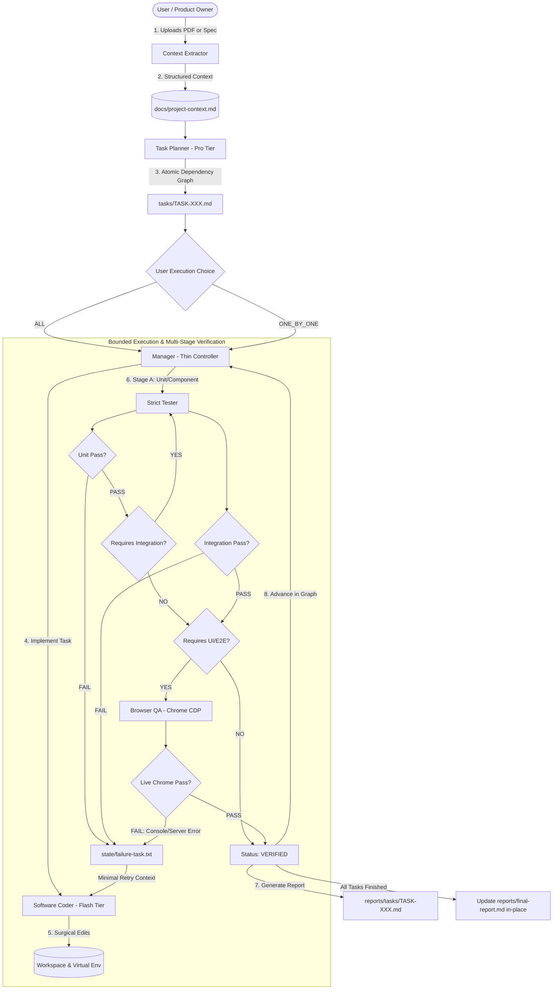

# ⚡ AgentForge: Autonomous Multi-Agent Software Development System

> **A native, token-efficient multi-agent software engineering framework built for Google Antigravity.**  
> Transform high-level product specifications (PDFs or Markdown) into fully implemented, tested, and verified full-stack applications with zero human code intervention.

---

## 🚀 Overview

**AgentForge** coordinates an autonomous team of **6 role-specialized AI agents** operating on a bounded, deterministic finite-state loop. Rather than relying on simple single-prompt code generation, AgentForge mirrors a real-world engineering team:



---

## 🎯 Key Architectural Pillars

1. **No In-Memory Mock Illusions**: Tasks requiring browser verification are audited in **real Google Chrome via Playwright and Chrome DevTools Protocol (CDP)** with live server process log tailing.
2. **Dual-Stream Error Auditing**: Intercepts uncaught browser console errors (`pageerror`, `console.error`) and tails backend server streams (`stdout`/`stderr`). Any crash or HTTP 500 triggers an instant failure.
3. **Aggressive Token Efficiency (Thin Controller)**: The Manager Agent is a lightweight state controller. It never loads full project context, source code, or historical retry logs into memory.
4. **Multi-Stage Verification Pipeline**: Explicitly decouples verification into **Unit**, **API Integration**, and **Browser UI/E2E** stages.
5. **Continuous Project Evolution (Change Sessions)**: Built-in change detection categorizes user requests (Informational vs Bug Fix vs Feature Modification vs New Feature). Unaffected verified tasks remain untouched, while affected tasks are reopened or superseded.
6. **Immutable Historical Snapshots**: Canonical context lives in `docs/project-context.md`, while immutable versions are archived under `docs/project-context-history/`.

---

## 🤖 The 6-Agent Model

| Agent | Model Policy | Role & Operational Boundary | Output Contract |
| :--- | :---: | :--- | :--- |
| **`context_extractor`** | `FAST_CODING` (Flash) | Ingests raw PDFs/specs into standardized `docs/project-context.md`. Explicitly marks unspecified items as `UNKNOWN`. | `docs/project-context.md` |
| **`planner`** | `HIGH_REASONING` (Pro) | Decomposes architecture into atomic, sequential tasks. Flags integration and UI requirements. Performs Change Request impact analysis. | `tasks/TASK-XXX.md` |
| **`manager`** | `ORCHESTRATOR` (Inherit) | Thin state controller. Enforces dependency gates, executes bounded retries (`MAX_ITERATIONS = 3`), respects execution mode, and updates reports. | `state/loop-state.md` |
| **`coder`** | `FAST_CODING` (Flash) | Surgical implementation specialist. Confined to single task files, service boundaries, local environments (`.venv`), and manifests (`requirements.txt`). | Code diffs + test runs |
| **`strict_tester`** | `FAST_TESTING` (Flash) | Cleanroom independent verifier. Audits manifests, runs automated tests against isolated test databases, and executes live server smoke tests. | Machine-readable `RESULT: PASS/FAIL` |
| **`browser_qa`** | `FAST_BROWSER` (Flash) | Full-stack UI verifier. Automates real Google Chrome, verifies user-to-backend flows, audits console logs, and inspects visual layouts. | Machine-readable `RESULT: PASS/FAIL` + screenshots |

---

## 🚦 Operational Modes

### Mode A: New Project Development
Use this mode when building a brand new application from scratch:
1. Place your specification PDF in `docs/project-overview.pdf` (or use `project_overview_template.md`).
2. Instruct the Antigravity agent:
   ```text
   Initialize project from docs/project-overview.pdf
   ```
3. Context Extractor extracts the schema $\rightarrow$ Planner generates tasks $\rightarrow$ System asks for your execution choice (`ALL` vs `ONE_BY_ONE`).
4. Manager executes the build loop $\rightarrow$ Produces per-task reports and the canonical `reports/final-report.md`.

### Mode B: Existing Project Change (Continuous Evolution)
Use this mode to maintain or enhance an already-built project:
1. Instruct the Antigravity agent in plain English:
   ```text
   Add recurring expenses support to the dashboard.
   ```
2. **Change Detection** automatically detects this as a `New Feature` and creates `changes/CR-001.md`.
3. **Planner Impact Analysis**:
   - Analyzes existing codebase and verified tasks.
   - Unaffected tasks remain `VERIFIED`.
   - Directly altered components are marked `REOPENED` or `SUPERSEDED`.
   - New sequential tasks are generated (`TASK-005.md`, etc.).
4. You select the execution mode (`ALL` vs `ONE_BY_ONE`).
5. Tasks execute through verification $\rightarrow$ `reports/final-report.md` is updated in-place.

---

## ⚡ Quick Start Guide

### 1. Clone the Template
```bash
git clone https://github.com/your-username/agentforge.git my-new-project
cd my-new-project
```

### 2. Define Your Project
Create a specification using the provided template or drop in an existing PDF:
```bash
cp project_overview_template.md docs/project-overview.md
# Edit docs/project-overview.md with your features, tech stack, and API endpoints
```

### 3. Launch in Antigravity
Open the project directory in Antigravity and prompt the agent:
```text
Please bootstrap the project using docs/project-overview.md
```

### 4. Choose Execution Mode
When prompted by the agent:
* **Option 1 (`ALL`)**: Build and verify all tasks autonomously end-to-end.
* **Option 2 (`ONE_BY_ONE`)**: Build one task at a time, pause, review the task report, and say "Continue" to proceed.

---

## 📁 Repository Structure

```text
agentforge/
├── .agents/
│   ├── agents/
│   │   ├── browser_qa/agent.md          # Chrome CDP & UI verification specialist
│   │   ├── coder/agent.md               # Surgical task implementation specialist
│   │   ├── context_extractor/agent.md   # PDF/spec extraction into project context
│   │   ├── manager/agent.md             # Thin deterministic controller loop
│   │   ├── planner/agent.md             # Architectural planning & CR impact analysis
│   │   └── strict_tester/agent.md       # Cleanroom verification & manifest audits
│   ├── skills/
│   │   ├── browser-qa/                  # Chrome automation guidelines & platform matrix
│   │   ├── coding/                      # Scope control & dependency manifests
│   │   ├── project-bootstrap/SKILL.md   # Service structure & environment setup
│   │   ├── project-context/SKILL.md     # Progressive disclosure & versioning
│   │   ├── task-planning/               # Task graph & CR lifecycle
│   │   └── testing/SKILL.md             # Cleanroom verification & smoke test rules
│   ├── change-detection.md              # Request classification protocol (Info vs Fix vs Feature)
│   └── model-policy.md                  # Abstract model policies (Flash vs Pro)
├── changes/
│   ├── .gitkeep
│   └── change-request-schema.md         # Schema for CR-XXX change requests
├── docs/
│   ├── project-context-history/         # Immutable snapshots of baseline contexts
│   │   └── .gitkeep
│   └── project-context-schema.md        # Canonical project context schema
├── evidence/
│   ├── .gitkeep
│   └── README.md                        # Audit trail evidence guidelines
├── prompts/
│   └── extract-context.md               # Context extraction prompt template
├── reports/
│   ├── tasks/                           # Per-task completion reports (TASK-XXX.md)
│   │   └── .gitkeep
│   ├── .gitkeep
│   └── README.md                        # Canonical reporting model documentation
├── schemas/
│   ├── escalation-schema.md             # Standardized escalation format
│   ├── failure-context-schema.txt       # Minimal failure payload format
│   ├── final-report-schema.md           # Authoritative final project report schema
│   └── task-report-schema.md            # Authoritative task report schema
├── state/
│   ├── .gitkeep
│   ├── current-task.md                  # Compact runtime task state
│   └── loop-state.md                    # Compact finite state machine tracker
├── tasks/
│   ├── .gitkeep
│   └── task-schema.md                   # Authoritative task specification schema
├── .gitignore                           # Pre-configured for Python, Node, caches, test DBs
├── parser.py                            # Deterministic result parser
├── project_overview_template.md         # Template for project specifications
└── README.md                            # System documentation
```

---

## 🛡️ Best Practices for Production

1. **Always Use Dedicated Environments**:
   * For Python: Always utilize `.venv`.
   * For Node: Always utilize local `node_modules` and package scripts.
   * For Rust / Go: Always utilize project-local build caches.
2. **Never Commit Secrets**: Use `.env.example` templates with placeholder dummy tokens.
3. **Isolate Test Databases**: Automated test suites must target local SQLite/test instances, never production databases.
4. **Preserve Task Independence**: Tasks must never depend on unverified assumptions; always declare prerequisite IDs in `Dependencies:`.

---

## 📄 License
This framework is open-sourced under the [MIT License](LICENSE).
